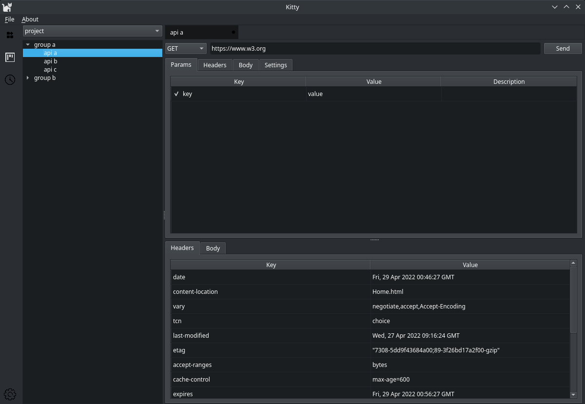

# Kitty

API 工具。

[English](./README.md) | 中文



## 编译

### Linux与macOS

```sh
$ git clone --recursive https://github.com/TaipaXu/kitty.git && cd kitty
$ mkdir build && cd build
$ cmake ..
$ make
```

### Windows

#### 使用Qt Creator MSVC编译器编译此项目。

## 协议

[GPL-3.0](LICENSE)
